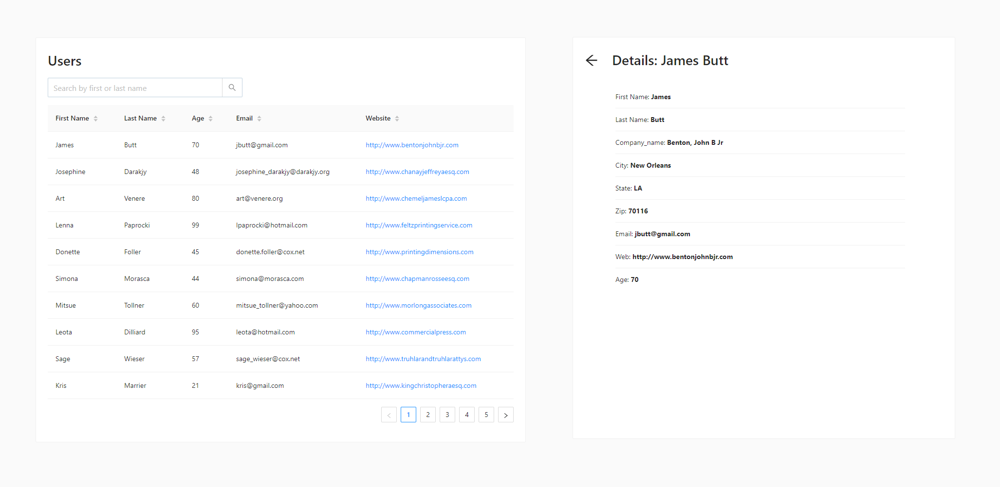

# React Assignment

Created a react application which provides following functionalities:

- list users in a table
- search for a user
- sort columns of table
- pagination of users list
- detail page for each user on a separate route
- 
**Task Overview**
Followed all instructions to create the required application. I strictly followed the wireframes and guidelines given for the UI and functionalities.

## API endpoint used:
_[User Data](https://d2k-static-assets.s3.ap-south-1.amazonaws.com/assignment-files/python-backend-assignment/users.json)_
I made use of CORS anywhere proxy to access the api as the endpoint did not allow CORS requests.
However, proxies don't work on deployed applications & Github Pages can serve Static content only..
Hence, I stored the data from the api in a constants file.

another approach is that we can create a server side code using express in order to pass the CORS issue and then deploy it on other hosting services. you can find the code for this in https://github.com/Aj-654/react-assignment-level-1/tree/feature/issue-4

## **Instructions**
- npm install to install node modules
- npm run start to run the app in development mode
- npm run build to build for production
- npm run deploy to deploy the application on github pages

## Wireframes:

Wireframes for users table page _(left)_ and user detail page _(right)_

## Application Snippet
Users page displaying details in a table

displaying user details on another page

